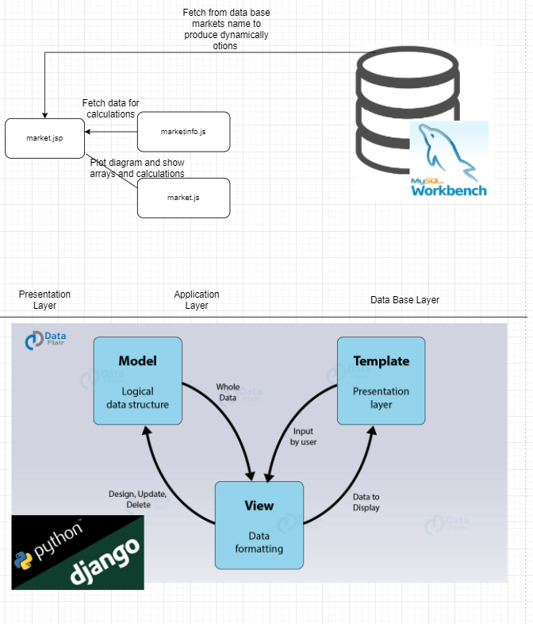
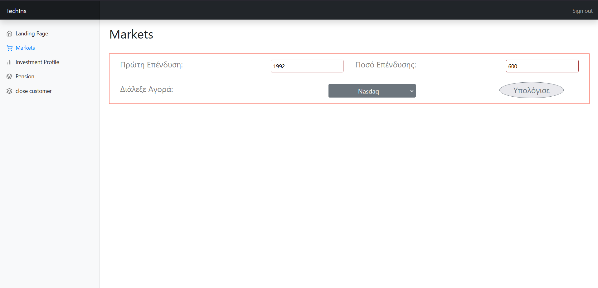
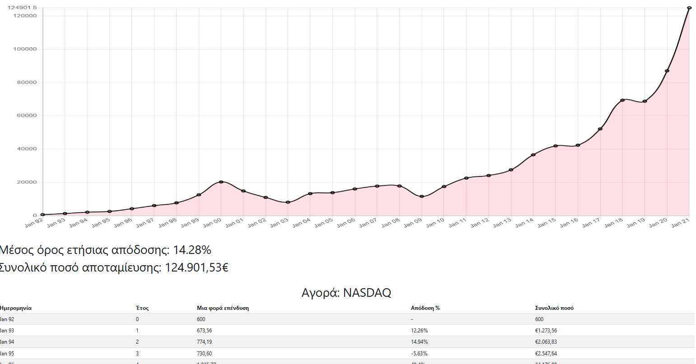

__DJANGO FRAMEWORK__

This project created to convert an already implemented use case to framework Django.   

Here is a diagram that shows exaclty what I will implement : 

Execute it with 
    
    python manage.py runserver 

    url : http://127.0.0.1:8000/playground/markets/

Result : 

 

